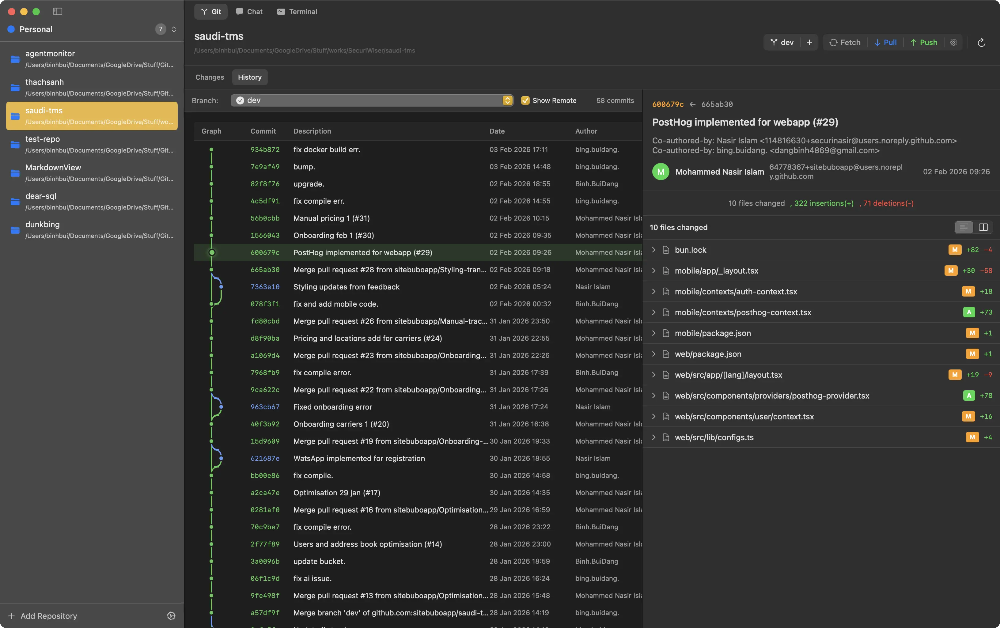

# Oshin

A macOS app for monitoring AI coding agents. Git client, terminal, and agent chat in one place.



## Features

- **Multi-Agent Monitoring** — Watch Claude Code, Codex, and Gemini CLI work
- **Git Client** — Stage, commit, view diffs, branch history with visual graph
- **Integrated Terminal** — Powered by Ghostty, multiple sessions per project
- **Workspace Organization** — Group repositories, switch contexts instantly

## Requirements

- macOS 14.0+
- Xcode 16+

## Build

```bash
swift build
swift run
```
